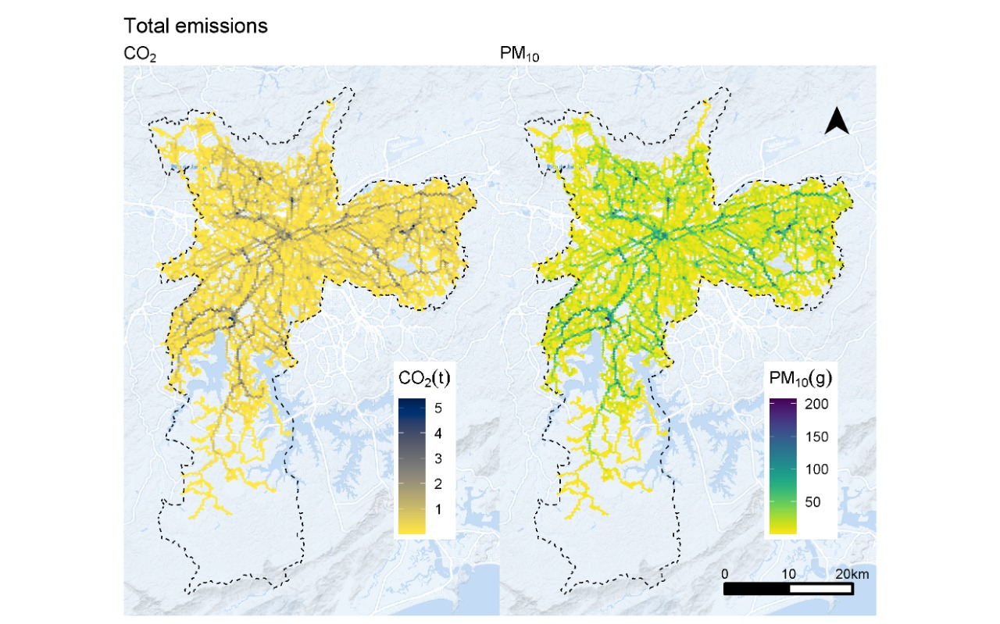

I'm excited to share that `gtfs2emis` R package is finally out! 

For over two years I've been working with my colleagues Rafa Pereira and Pedro Andrade on the development of an R package that estimates public transport emissions based on GTFS (General Transit Feed Specification) data. After quite a lot of work, the package today supports hot-exhaust emissions estimates from four emission factor models ([MOVES/EPA](https://www.epa.gov/moves), [EMFAC2017/CARB](https://arb.ca.gov/emfac/), [CETESB](https://cetesb.sp.gov.br/veicular/relatorios-e-publicacoes/) and [EMEP/EEA](https://www.eea.europa.eu/themes/air/air-pollution-sources-1/emep-eea-air-pollutant-emission-inventory-guidebook/emep)), with a lot of handy functions for post-processing data.

The package requires two main inputs: i) public transport data in GTFS standard format; and ii) some basic information on fleet characteristics such as vehicle age, technology, fuel, and Euro stage. As it stands, the package estimates several pollutants (see table below) at high spatial and temporal resolutions. Pollution levels can be calculated for specific transport routes, trips, time of the day, or for the transport system as a whole. The output with emission estimates can be extracted in different formats, supporting analysis of how emission levels vary across space, time, and fleet characteristics.

The Figure below shows the spatial distribution of emissions in São Paulo from the public transport system produced using `gtfs2emis`. 

Check out [GitHub repository](https://github.com/ipeaGIT/gtfs2emis) and our [vignette](https://ipeagit.github.io/gtfs2emis/articles/gtfs2emis_intro_vignette.html) for details on how to use `gtfs2emis`.